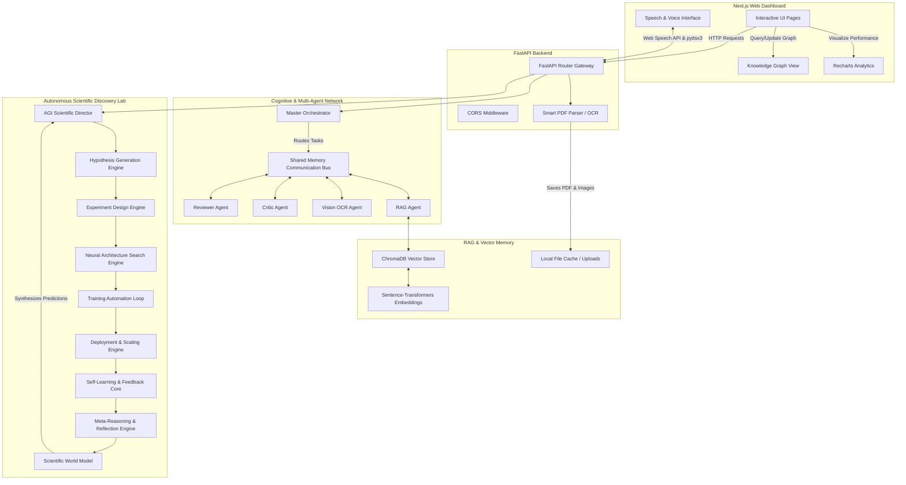

# 🔬 ResearchMind AI — Autonomous Scientific Discovery & Intellect Engine

ResearchMind AI is an advanced, AGI-powered research assistant and autonomous scientific laboratory. It bridges the gap between raw academic literature and proactive knowledge synthesis by combining multimodal PDF parsing, semantic indexing (RAG), voice-guided interactive chat, multi-agent critique orchestration, live research alerts, and a fully automated autonomous research loop (spanning hypothesis generation, Neural Architecture Search, training automation, deployment, self-learning, and meta-reasoning).

---

## 🗺️ System Architecture

The diagram below details the interaction between the Next.js frontend, the FastAPI gateway, the RAG memory subsystem, the specialized multi-agent cognitive layers, and the autonomous scientific discovery pipelines.



---

## ✨ Core Features & Implemented Systems

### 1. Smart PDF Processing & Multimodal OCR
*   **Deep Text Parsing:** Extracts title, authors, abstract, keywords, DOI, and sections (Introduction, Methodology, Results, Conclusion, etc.) using `pdfplumber` and `PyMuPDF`.
*   **Visual & OCR Extraction:** PyMuPDF extracts figures and tables, passing them to `easyocr` and custom interpreters to analyze table contents, chart labels, and diagram flows.

### 2. Deep Research Criticism & Scoring
*   **Multi-Dimension Scoring:** Computes objective ratings for **Novelty**, **Clarity**, **Technical Quality**, **Reproducibility**, **Dataset Quality**, and **Innovation**.
*   **Critic Evaluations:** Generates comprehensive lists of strengths, weaknesses, and step-by-step reproducibility checklists.

### 3. Document RAG & Interactive Q&A
*   **Local Vector Storage:** Indexes parsed document chunks using `sentence-transformers` and stores them in `chromadb`.
*   **Smart Chat:** Context-aware Q&A system that fetches relevant paper sections to answer detailed technical inquiries.

### 4. Interactive Knowledge Graph Visualizer
*   **Entity & Relation Extraction:** Analyzes texts to isolate key scientific concepts, datasets, methodologies, and findings.
*   **Visual Topologies:** Renders real-time interactive nodes and links directly in the frontend using D3/graph-mode styles.

### 5. Multi-Paper Comparative Analysis
*   **Side-by-Side Review:** Compares two papers on methodology, dataset utilization, mathematical framework, and scientific contributions.

### 6. Voice-Guided Assistant (Text-to-Speech / Speech-to-Text)
*   **Narrations & Listening:** Aloud summaries and voice-based querying.
*   **Dual Speech Driver Support:** Integrates browser-native Web Speech API and backend `pyttsx3`/`SpeechRecognition` drivers.

### 8. Real-Time Tracking & Alerting
*   **arXiv Tracker:** Regularly monitors arXiv directories for newly published papers on designated topics.
*   **Spike & Breakthrough Detection:** Flags sudden scientific interest spikes or potential breakthroughs.
*   **Live Feeds:** Personalized academic recommendation feed utilizing semantic similarity interest-profiling.

### 9. Autonomous Scientific Discovery Lab
*   **Hypothesis Engine:** Uncovers research gaps, generates cross-domain research proposals, and runs validation algorithms.
*   **Experiment Design Engine:** Automatically plans experiments, selects baseline models/datasets, and generates execution blueprints.
*   **Neural Architecture Search (NAS):** Designs candidates within specified search spaces, runs model evaluators, and exports optimal neural network architectures.
*   **Training Automation:** Generates training pipelines, handles datasets, builds models, schedules checkpointers, and evaluates runs.
*   **Deployment Engine:** Auto-packages models, runs an API Gateway, handles version control, auto-scales, and monitors inference.
*   **Self-Learning Loop:** Gathers feedback, logs adaptation steps, and updates the local agent memory for future designs.
*   **Meta-Reasoning & Cognitive Refinement:** Detects biases, reflects on historical pipeline errors, and executes self-corrections.
*   **AGI Research Director:** Orchestrates global planning and cognitive routing across all engines under a governor dashboard.
*   **Scientific World Model:** Models future simulations, forecasts trends, and provides predictive reasoning reports.

---

## 🛠️ Tech Stack

### Frontend
*   **Framework:** Next.js 16.2 (App Router, React 19)
*   **Language:** TypeScript
*   **Styling:** Vanilla CSS, TailwindCSS v4
*   **Visualization:** Recharts & custom interactive graphs
*   **HTTP Client:** Axios

### Backend
*   **Framework:** FastAPI (Python 3.x), Uvicorn
*   **PDF/Image Extraction:** `pdfplumber`, `PyMuPDF` (`fitz`), `easyocr`, `opencv-python`
*   **Embeddings & Database:** `sentence-transformers`, `chromadb`
*   **ML & Data Processing:** `torch`, `torchvision`, `transformers`, `numpy`, `pandas`, `scipy`, `scikit-learn`, `networkx`
*   **Report Exporters:** `reportlab` (PDF), `python-docx` (DOCX), `python-pptx` (PPTX)
*   **Voice & Search Integration:** `pyttsx3`, `SpeechRecognition`, `arxiv`

---

## 📁 Project Structure

```
researchmind-ai/
├── backend/
│   ├── app/
│   │   ├── agents/                   # Base agent classes
│   │   ├── agi_director/             # AGI research governance & execution planner
│   │   ├── agi_reasoning/            # Logic, fusion, multimodal AGI reasoning
│   │   ├── ai/                       # Summarizer, Critic, Scoring, and Vision OCR engines
│   │   ├── alerts/                   # Alert monitors, spike detection, notifications
│   │   ├── api/routes/               # 34 endpoint routers (upload, chat, nas, world-model, etc.)
│   │   ├── autonomous_execution/     # Goal solvers, decomposers, execution engines
│   │   ├── copilot/                  # Interactive co-pilot logic, user profiling
│   │   ├── deployment_engine/        # Model packaging, versioning, inference API gateway
│   │   ├── experiment_engine/        # Experiment planning, dataset selectors, evaluation
│   │   ├── memory/                   # Short, long-term, and vector memory
│   │   ├── meta_reasoning/           # Metacognition, bias detection, error correction
│   │   ├── multi_agents/             # Cooperative multi-agent simulation & shared bus
│   │   ├── nas_engine/               # Neural Architecture Search core, search-spaces, evaluators
│   │   ├── realtime_research/        # arXiv fetcher, trend trackers, analyzers
│   │   ├── recommendation_engine/    # Semantic similarity rankers & feed generators
│   │   ├── self_learning/            # Adaptation loops, feedback trackers
│   │   ├── training_engine/          # Automated training pipeline generators & checkpointing
│   │   ├── world_model/              # Temporal simulation, trend forecasting, breakthrough prediction
│   │   ├── main.py                   # FastAPI main entry point
│   │   └── requirements.txt          # Python dependencies
├── frontend/
│   ├── app/
│   │   ├── dashboard/page.tsx        # Unified Next.js dashboard workspace
│   │   ├── page.tsx                  # Landing page
│   │   └── globals.css               # Main CSS styles
│   ├── components/
│   │   ├── charts/                   # Recharts visualizations
│   │   ├── dashboard/                # Analytics layout components
│   │   └── knowledge_graph/          # Dynamic entity-relation visualizer
│   ├── services/
│   │   └── api.ts                    # Backend API Axios endpoints & interfaces
│   ├── package.json                  # Next.js workspace configurations
│   └── tsconfig.json                 # TypeScript configurations
├── tests/                            # PyTest unit suite (26 separate engine tests)
└── README.md                         # Main documentation (this file)
```

---

## 🚀 Getting Started

### Prerequisites
*   Python 3.9+
*   Node.js 18+ (npm or yarn)

### 1. Setup Backend
1.  Navigate to the `backend` workspace (or stay at root if using root references):
    ```bash
    # Create virtual environment
    python -m venv venv
    
    # Activate virtual environment
    # On Windows:
    .\venv\Scripts\activate
    # On macOS/Linux:
    source venv/bin/activate
    ```
2.  Install required dependencies:
    ```bash
    pip install -r requirements.txt
    ```
3.  Launch the FastAPI server:
    ```bash
    uvicorn app.main:app --reload --port 8000
    ```
    *   The backend will start running on [http://127.0.0.1:8000](http://127.0.0.1:8000)
    *   Access the swagger API documentation at [http://127.0.0.1:8000/docs](http://127.0.0.1:8000/docs)

### 2. Setup Frontend
1.  Navigate to the `frontend` folder:
    ```bash
    cd frontend
    ```
2.  Install Node dependencies:
    ```bash
    npm install
    ```
3.  Start the Next.js development server:
    ```bash
    npm run dev
    ```
    *   The frontend dashboard will run on [http://localhost:3000](http://localhost:3000)

---

## 🧪 Running Unit Tests

The backend is guarded by 26 separate Python test suites, verifying endpoints, database caching, search spaces, and autonomous planning engines.

To run the complete test suite:
1.  Ensure your virtual environment is active.
2.  Run pytest from the root folder:
    ```bash
    pytest
    ```
3.  To run specific tests (e.g. recommendation system tests):
    ```bash
    pytest tests/test_recommendations.py
    ```

---

## 📊 Summary of Implemented Modules (Under Unit Tests)
The following key modules are implemented and verified via unit tests in the `/tests` folder:
*   **`test_upload.py` / `test_rag.py`:** Smart document ingest, text parsing, database insertion, and semantic chunk retrieval.
*   **`test_semantic_search.py` / `test_comparison.py`:** Cross-document search queries and paper comparisons.
*   **`test_recommendations.py` / `test_live_alerts.py`:** Profile similarity matching, recommender ranking, trend tracking, and alert triggers.
*   **`test_hypothesis_generation.py` / `test_experiment_engine.py`:** Automated gap detection, training blueprints, and selector matrices.
*   **`test_nas_engine.py` / `test_training_automation.py`:** Dynamic neural structural search, candidate scoring, training iterations, and checkpoint managers.
*   **`test_deployment_engine.py`:** Package exporter, gateway configurations, and scaling indicators.
*   **`test_self_learning.py` / `test_meta_reasoning.py`:** Adaptive memory buffers, reflection loops, self-correction algorithms, and bias filtering.
*   **`test_world_model.py` / `test_agi_director.py`:** Simulator states, predictive reasoning pathways, and autonomous research cycles.
"# Algonive_researchmind_ai" 
