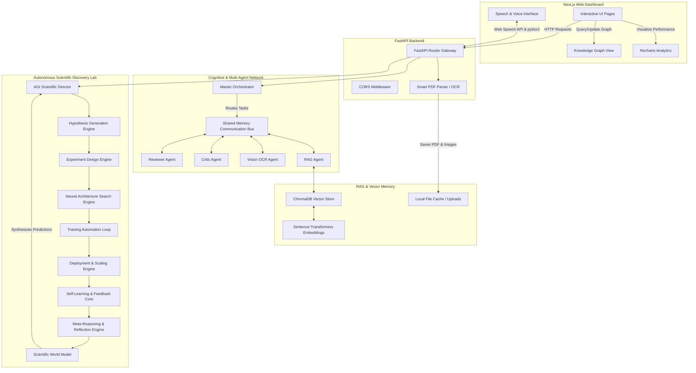

# 🔬 ResearchMind AI — Autonomous Scientific Discovery & Intellect Engine

[](https://www.python.org/)
[](https://nodejs.org/)
[](https://nextjs.org/)
[](https://fastapi.tiangolo.com/)
[](LICENSE)

ResearchMind AI is a next-generation AI-powered research intelligence platform designed to help students, researchers, academicians, and innovators analyze, understand, compare, and discover scientific knowledge faster.

The platform combines advanced PDF understanding, multimodal document analysis, semantic search, retrieval-augmented generation (RAG), research criticism, knowledge graphs, literature intelligence, recommendation systems, and AI-powered research assistance into a single unified ecosystem.

ResearchMind AI transforms research papers into structured knowledge, enabling users to generate summaries, evaluate research quality, identify gaps, compare multiple papers, discover emerging trends, and build a personalized research knowledge base.

---

## 🗺️ System Architecture

The diagram below details the interaction between the Next.js frontend dashboard, the FastAPI gateway, the RAG memory subsystem, the specialized multi-agent cognitive layers, and the autonomous scientific discovery pipelines.



### Modular Interaction Flow:
```
Frontend Layer ──► Next.js Dashboard ──► FastAPI Backend ──► AI Intelligence Layer ──► RAG & Vector DB ──► Research Knowledge Base ──► Recommendation & Discovery Engine
```

---

## 📚 Technical Manuals & Guides

For deep technical implementation details, explore the sub-guides:

*   **[🏁 Getting Started Setup](file:///c:/Users/devap/Documents/researchmind-ai/docs/getting_started.md)**: Steps to install, configure, and boot the frontend and backend locally.
*   **[🗺️ System Architecture Guide](file:///c:/Users/devap/Documents/researchmind-ai/docs/architecture.md)**: Deep dive into the agent bus communication, database schemas, and global data flows.
*   **[🤖 Autonomous Scientific Discovery Loop](file:///c:/Users/devap/Documents/researchmind-ai/docs/autonomous_agents.md)**: Breakdown of the 9 cognitive sub-engines coordinating model training, architecture search, and self-adaptation.
*   **[📡 API Directory Reference](file:///c:/Users/devap/Documents/researchmind-ai/docs/api_endpoints.md)**: Reference listing payload structures and routing for all endpoints.
*   **[🐳 Docker Containerization Setup](file:///c:/Users/devap/Documents/researchmind-ai/docker/README.md)**: Quick-start commands for booting the platform using Docker Compose.

---

## 🚀 Key Features

### 📄 Smart Research Paper Processing
*   **PDF Upload & Management**: Secure upload gateways supporting multi-file and bulk staging.
*   **Advanced PDF Parsing**: Extracts metadata, authors, DOI, and splits documents into sections using `pdfplumber` and `PyMuPDF`.
*   **OCR-Based Extraction & Vision**: Uses `easyocr` and OpenCV pipeline filters to extract visual figures, diagrams, and tabular data.

### 🧠 AI Research Understanding Engine
Autonomously generates:
*   **TL;DR summaries** & Executive summaries.
*   **Section-wise outline analysis** and Key Contributions.
*   **Research Objectives**, Methodology Overviews, Results Interpretation, and Conclusion summaries.

### ⭐ Research Critic Engine
Critically evaluates papers:
*   **Strengths & Weaknesses**: Analysis of structural quality and baseline comparisons.
*   **Methodology & Design**: Identifies limitations, dataset adequacy, experimental flaws, and potential biases.

### 📊 Evidence-Based Research Scoring
Computes quantitative indicators with citation evidence:
*   Novelty, Innovation, Technical Quality, Clarity, Dataset Quality, and Reproducibility.
*   Aggregates metrics to produce a unified **Research Health Score**.

### 🏷️ AI Research Classification
Categorizes scientific papers automatically:
*   **Core Fields**: AI, ML, Deep Learning, Computer Vision, NLP, Data Science, Healthcare AI, Cybersecurity, FinTech, and Robotics.
*   **Attributes**: Research Type, Application Domain, Complexity level, and Industry Relevance.

### 📈 Research Metrics & Document Intelligence
Calculates document statistics:
*   Page and word count, reading estimation, references count.
*   Figure, table, and equation counts.
*   Computes **Technical Density**, **Methodology Depth**, and **Document Intelligence Score**.

### 🔍 Semantic Search & RAG Chat
*   Ask questions directly from uploaded papers using context-aware Retrieval-Augmented Generation (RAG).
*   Allows multi-paper queries with accurate citation mappings.

### 🕸️ Semantic Knowledge Graph
Autonomously maps concepts to build visual networks:
*   **Entities**: Models, Datasets, Methods, Tasks, Frameworks, Metrics, Organizations, and Authors.
*   **Relationships**: `TRAINS_ON`, `USES`, `IMPROVES`, `COMPARES_WITH`, `OUTPERFORMS`, `IMPLEMENTED_IN`, `EVALUATED_ON`, and `CITES`.

### 📚 Multi-Paper Research Intelligence
*   Performs side-by-side analysis, benchmarking, and consensus/contradiction detection across papers to locate research gaps.

### 📝 Automated Literature Review Generator
*   Constructs publication-style literature reviews complete with Introduction, Related Work, Comparative Analysis, Research Trends, Gaps, and Future Directions.

### 🎯 Hybrid Research Recommendation Engine
Filters research updates based on hybrid profiles:
*   Combines **Semantic similarity**, **Entity similarity**, **Knowledge graph connections**, and user research history to suggest papers, datasets, models, and topics.

### 🤖 AI Research Copilot
*   Interactive dashboard companion capable of explaining formulas, suggesting architectures, and supporting literature review formulation.

### 📤 Export Center
*   Download generated summaries, critiques, scores, and knowledge graphs into professional **PDF**, **DOCX**, and **PPT** presentations.

---

## 🛠️ Technology Stack & Tools

### Frontend
*   **Frameworks**: Next.js 15.2 (App Router), React 19, TypeScript
*   **Styling**: Tailwind CSS v4, Vanilla CSS
*   **Visualizations**: Recharts, D3.js

### Backend
*   **Framework**: FastAPI, Python 3.9+
*   **Database ORM**: SQLAlchemy (PostgreSQL / SQLite support)

### AI & Natural Language Processing
*   **Hugging Face Transformers**
*   **Sentence Transformers** (e.g. `all-MiniLM-L6-v2` for 384-dimensional embeddings)
*   **PyTorch** (Neural Network models execution)
*   **SciSpaCy** & NLP tokenizers
*   **EasyOCR** & **OpenCV** (Vision-based chart/table extracting)

### Research Intelligence & Databases
*   **ChromaDB** (Vector memory indexing)
*   **NetworkX** (Mathematical graph topology algorithms)
*   **Redis** (Rate-limiting and monitoring cache)

---

## 📁 Repository Directory Layout

```
researchmind-ai/
├── backend/                   # FastAPI gateway & AI services core
│   ├── app/                   # Source code folder
│   │   ├── agents/            # Base agent classes
│   │   ├── agi_director/      # AGI planning & orchestration
│   │   ├── agi_reasoning/     # Logic fusion & multimodal reasoning
│   │   ├── ai/                # Summarizers, critics, and scoring
│   │   ├── api/routes/        # 34 endpoint routers (upload, chat, nas, etc.)
│   │   ├── core/              # Global settings, rate limiters, logging
│   │   ├── database/          # SQLite models, sessions, and connections
│   │   ├── memory/            # Semantic RAG collections & episodic loops
│   │   └── main.py            # Backend gateway entry point
│   ├── Dockerfile             # Backend container image settings
│   └── requirements.txt       # Python dependencies
├── frontend/                  # Next.js Dashboard UI
│   ├── app/                   # App Router dashboard pages & globals
│   ├── components/            # Recharts analytics & D3 Knowledge Graphs
│   ├── services/              # API Axios client connectors
│   ├── Dockerfile             # Frontend container image settings
│   └── package.json           # Node configuration
├── docker/                    # Multi-container orchestration configurations
│   ├── docker-compose.yml     # Compose config running frontend, backend, and Redis
│   └── README.md              # Container installation instructions
├── docs/                      # Technical manuals & architecture references
│   ├── architecture.md        # Comprehensive system architectural walkthrough
│   ├── api_endpoints.md       # API routers directory & JSON formats
│   ├── getting_started.md     # Step-by-step developer setup tutorial
│   └── autonomous_agents.md   # Interactive agents loops design
└── README.md                  # Global presentation file (this file)
```

---

## 🎯 Use Cases

*   **Students**: Understand academic papers faster, generate pre-formatted literature reviews, and organize project references.
*   **Researchers**: Parse and cross-reference hundreds of papers, discover research gaps, and identify emerging trend pathways.
*   **Startups**: Perform high-quality tech analysis, track competitive literature, and discover new patent/innovation directions.
*   **Academic Institutions**: Assist laboratories, organize reference indices, and provide verification scoring tools.

---

## 📊 Core Capabilities Matrix

| Feature | Status |
| :--- | :---: |
| PDF Parsing | ✅ |
| OCR Analysis | ✅ |
| AI Summarization | ✅ |
| Research Critique | ✅ |
| Research Classification | ✅ |
| Research Metrics | ✅ |
| Evidence-Based Scoring | ✅ |
| RAG Chat | ✅ |
| Knowledge Graph | ✅ |
| Multi-Paper Analysis | ✅ |
| Literature Review Generation | ✅ |
| Recommendation Engine | ✅ |
| Research Memory | ✅ |
| AI Research Copilot | ✅ |
| Export Center | ✅ |

---

## 🔮 Future Scope

*   **Live arXiv Monitoring**: Auto-ingests arXiv submissions matching user interest profiles daily.
*   **Research Trend Forecasting**: Uses historical metadata curves to project upcoming breakthrough topics.
*   **Citation Impact Prediction**: Estimates future citation scaling using citation path nodes.
*   **Autonomous Research Advisor**: Employs AI multi-agents to orchestrate meta-discussions.

---

## 🚀 Running Locally

### 1. Run Backend Gateway
```bash
cd backend
python -m venv venv

# Windows Activation:
.\venv\Scripts\activate
# macOS/Linux Activation:
source venv/bin/activate

pip install -r requirements.txt
python create_tables.py
uvicorn app.main:app --reload --port 8000
```
*   **Swagger URL**: [http://127.0.0.1:8000/docs](http://127.0.0.1:8000/docs)

### 2. Run Frontend Dashboard
```bash
cd frontend
npm install
npm run dev
```
*   **URL**: [http://localhost:3000](http://localhost:3000)

---

## 🐳 Running with Docker
Run the entire platform instantly using Docker:
```bash
cd docker
docker compose up --build
```
This sets up Next.js, FastAPI, and Redis. Read the **[Docker Setup Manual](file:///c:/Users/devap/Documents/researchmind-ai/docker/README.md)** for details.

---

## 👨‍💻 Developer

**DEVAPRASATH K**  
*B.Tech Artificial Intelligence & Data Science*  
Mahendra Engineering College  
Namakkal, Tamil Nadu, India  

*   **LinkedIn**: [Devaprasath K](https://www.linkedin.com/in/k-devaprasath-a5079332b)  
*   **GitHub**: [@devaprasathk28-dot](https://github.com/devaprasathk28-dot)  

---

## ⭐ ResearchMind AI
*"Transforming Research Papers into Actionable Scientific Intelligence."*
# Algonive_researchmind_ai

