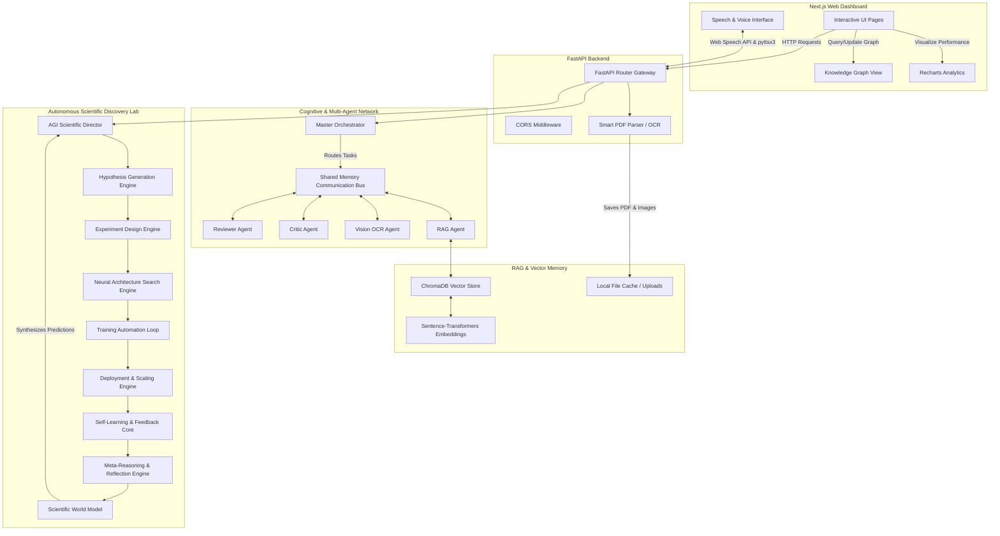

# 🗺️ System Architecture

This document describes the architectural design, agent topology, data schemas, and backend orchestration systems of the ResearchMind AI platform.

---

## 🏗️ High-Level Topology

The system uses a decoupled, three-tier architecture:
1.  **Frontend Dashboard**: A Next.js Web Dashboard powered by React 19 and TypeScript, providing interfaces for uploading research, running multi-agent simulations, modeling knowledge graphs, and monitoring neural architecture training.
2.  **API Gateway (FastAPI)**: Routes client requests, processes file uploads, runs OCR parsing models, and orchestrates the autonomous cognitive layers.
3.  **Memory & Caching Subsystem**: Managed by a SQLite/PostgreSQL relational database for transactions/profiles, ChromaDB for semantic indexing (RAG), and Redis for real-time monitoring counters and speed-limiting tokens.

---

## 🧠 Cognitive Layer & Agent Bus

The core of ResearchMind AI is its cooperative multi-agent architecture:

*   **Shared Memory Communication Bus**: Agents do not talk to each other in point-to-point lines. Instead, they write to and read from a shared cognitive message bus. This allows agents to react to state changes asynchronously.
*   **The Master Orchestrator**: Manages scheduling, coordinates responses, detects task termination criteria, and runs checks against potential feedback loops.
*   **Specialized Reviewer & Critic Agents**: Take parsed papers, extract strengths, score novelty, build step-by-step reproducibility guides, and flag inconsistencies in dataset size or baseline evaluations.

---

## 💾 Storage & Data Schemas

ResearchMind AI manages two separate databases:

### 1. Relational Database (SQLite fallback or PostgreSQL)
Stores application entities, structured analyses, metadata, and alerts. Below are the key tables defined in `app/database/models.py`:

*   `User`: Handles authentication profiles, secure password hashes, and workspace settings.
*   `ResearchPaper`: Holds paper metadata, DOI linkings, file hashes, and text paths.
*   `PaperAnalysis`: Stores scoring metrics (novelty, clarity, technical quality, reproducibility, overall) and JSON summaries.
*   `KnowledgeGraph`: Stores nodes (concepts, datasets, methods) and edges (relationships) extracted during parsing.
*   `ChatHistory`: Logs Q&A prompts and contextual answers to allow session resumption.
*   `Notification` & `FollowedTopic`: Manages user subscription feeds and real-time interest warnings.

### 2. Vector Store (ChromaDB)
Used to implement context-aware Retrieval Augmented Generation (RAG):
*   **Embedding Model**: Uses local `sentence-transformers` (e.g., `all-MiniLM-L6-v2`) to project raw paper chunks into a 384-dimensional vector space.
*   **Indexing & Storage**: Chunks are stored in a Chroma collection alongside metadata (filename, section title, page range) to support granular query routing.
